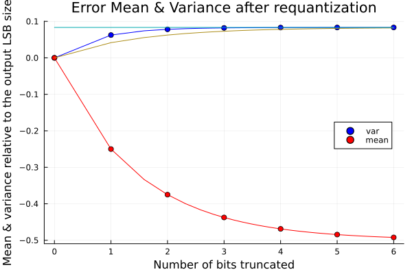

I recently came across this paper:

Truncation noise in fixed-point SFGs
G.A. Constantinides, P.Y.K. Cheung, and W. Luk
Electronics Letters Volume 35, Issue 23
https://doi.org/10.1049/el:19991375

It is interesting in that it claims an improved model of truncation noise in fixed-point signal processing.  This is a pretty basic concept that is taught in every DSP class.  It is very simple concept covering the quantization of signals that are already quantized. Their presentation makes is slightly more complex than necessary - maybe in an attempt to make it publishable as new work in 1999!

This paper was cited by "Truncation Noise Analysis of Noise Shaping DSP Systems With Applications to CIC Decimators", which will be commented on in the future.

Assuming white, uncorrelated noise, the quantization to a unit LSB size is commonly determined to be $\sigma_q^2 = \frac{1}{12}$.
The key observation of this paper, is that this equation assumes a continuous, rectangular, error probability distribution function (PDF), yet in digital systems where the input is already quantized, the error PDF is actually discrete.  It turns out that this makes a difference.

The Constantinides paper gives formula for quantizing from $(n_1,p)$ to $(n_2,p)$ where $n_i$ is the wordlength (excluding the sign bit) and $p$ is position of the binary point to the rightwards of the sign bit.  Using an explicit prefix to indiucate the format then 

$np(n,p)$ is equivalent to $iq(p+1,n-p)$

This is all unnecessarily complex.  Truncation is only concerned with LSB end of the numbers, and it is only the number of bits that are being truncated that matter.  The information shown in the three dimensional plots can be replaced by a simple graph of function of one variable.

## The noise models considered by the paper:

From here on, the number of bits being truncated is denoted by $q$.  The input to the quantization is assumed to be in $iq(n,q)$ format and the output is an integer with the format $iq(n,0)$ where the value of $n$ is not important.  The noise generated as result is determined in three ways:

### 1. The Simplified Model
 This assumes that the error can be modelled with a continuous rectangular PDF extending from -1 to 0.
 This gives a mean estimate of $-\frac{1}{2}$ and a variance estimate of $\frac{1}{12}$.

 This is the estimate that applies to quantization of a continuously variable quantity - similar to that of an anlog-to-digital converter (ADC).

### 2. The Unsimplified Model
This model takes into account the number of bits being truncated ($q$), by reducing the width of the continuous PDF.
For example, if two bits are being truncated, the possible values of the truncated LSBs are 
$\{00, 01, 10, 11\}$ representing values of 0, 
$\{ 0, - \frac{1}{4}, - \frac{1}{2}, - \frac{3}{4} \} $.
Thus the error, $e$ is bounded by $ -\frac{3}{4} <= e <= 0 $
and this range is used as for the simplified model.  

### 3. The Proposed Model

This model determines the mean and variance assuming a discrete PDF where all the possible values of the truncated bits are equally likely.

## Examples

The models were [coded](../../src/main_requant.jl) in Julia and verified by simple simulation of millions of random values.

The figure below summarises the result.

The most significant feature of this plot is that for zero truncation the mean and variance are both zero.  Duh!  But many quantization algorithms make this mistake.  Consider a system with several places were requantization occur.  It may be better to have fewer points of requantization and have fewer noise sources.

The proposed model's variance is bounded by the two other lines which are the other two models.

